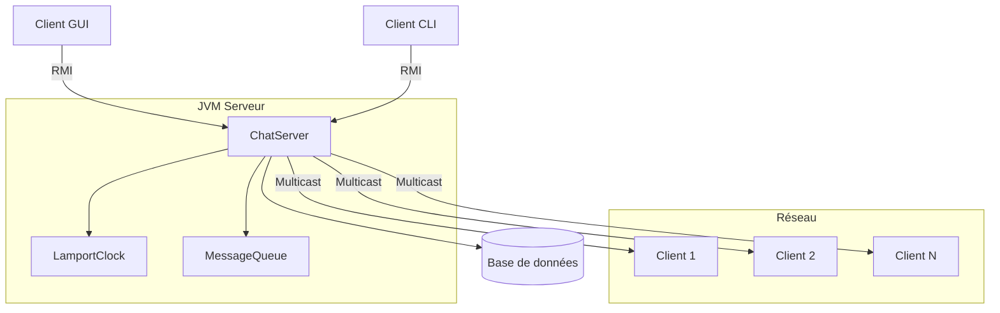

# 🚀 Chat Distribué avec Algorithme de Lamport

<div align="center">
  
  
  
  
</div>

## 📋 Description

Ce projet implémente un système de chat distribué utilisant Java RMI (Remote Method Invocation) avec l'algorithme d'horodatage logique de Lamport. Il permet une communication en temps réel entre plusieurs utilisateurs avec une cohérence garantie des messages, même dans un environnement distribué.

## ✨ Fonctionnalités Principales

### 🖥️ Serveur RMI
- Gestion centralisée des connexions clients
- Diffusion des messages à tous les clients connectés
- Implémentation de l'algorithme de Lamport pour la synchronisation
- Gestion des déconnexions propres
- Journalisation des événements

### 💻 Client RMI
- Connexion/Déconnexion au serveur
- Envoi et réception de messages en temps réel
- Interface en ligne de commande (CLI) interactive
- Commandes intégrées (`/help`, `/quit`, etc.)

### 🎨 Client GUI (Swing)
- Interface graphique moderne et intuitive
- Fenêtre de chat avec historique des messages
- Liste des utilisateurs connectés
- Indicateur d'état de connexion
- Thème clair/sombre (selon le système)

### ⏱️ Algorithme de Lamport
- Horodatage logique des événements
- Ordonnancement causal des messages
- Synchronisation distribuée
- Cohérence garantie entre tous les nœuds

## 🚀 Démarrage Rapide

### Prérequis
- Java 17 ou supérieur ([Télécharger](https://adoptium.net/))
- Maven 3.6+ ([Guide d'installation](https://maven.apache.org/install.html))
- Docker (optionnel, pour le déploiement conteneurisé)
- Git (pour cloner le dépôt)

### Installation

1. **Cloner le dépôt**
   ```bash
   git clone https://github.com/votrecompte/chat-distributed.git
   cd chat-distributed
   ```

2. **Compiler le projet**
   ```bash
   mvn clean install
   ```

3. **Exécuter le serveur**
   ```bash
   # Linux/Mac
   mvn exec:java -Pserver
   
   # Windows
   .\start-server.ps1
   ```

4. **Lancer un client**
   ```bash
   # Interface graphique (recommandé)
   mvn exec:java -Pclient-gui
   
   # Ou en ligne de commande
   mvn exec:java -Pclient
   ```

## 🐳 Déploiement avec Docker

### Configuration requise
- Docker Engine 20.10+
- Docker Compose 2.0+
- Au moins 2 Go de RAM disponible

### Étapes de déploiement

1. **Configurer les variables d'environnement**
   ```bash
   cp .env.example .env
   # Modifier les valeurs selon votre configuration
   ```

2. **Démarrer le serveur en conteneur**
   ```bash
   docker-compose up -d
   ```

3. **Vérifier les logs**
   ```bash
   docker-compose logs -f
   ```

4. **Accéder à l'application**
   - Ouvrir le client GUI sur votre machine
   - Se connecter à `localhost:1099`

### Variables d'environnement

| Variable | Description | Valeur par défaut |
|----------|-------------|-------------------|
| `CHAT_HOST` | Adresse IP du serveur | `localhost` |
| `SERVER_PORT` | Port du registre RMI | `1099` |
| `SERVER_NAME` | Nom du service RMI | `ChatServer` |
| `JAVA_OPTS` | Options JVM | Voir `.env` |

## 🛠️ Architecture Technique

### Composants Principaux



### Flux de Données

1. **Connexion Client**
   - Le client se connecte au registre RMI
   - Le serveur valide les informations de connexion
   - Une horloge Lamport est initialisée pour le client

2. **Envoi de Message**
   - Le client incrémente son horloge locale
   - Le message est horodaté et envoyé au serveur
   - Le serveur synchronise les horloges et diffuse le message

3. **Réception de Message**
   - Le serveur reçoit un message avec un timestamp
   - L'horloge du serveur est mise à jour
   - Le message est placé dans une file d'attente ordonnée
   - Les messages sont délivrés dans l'ordre logique correct

## 📚 Documentation Technique

### Structure du Projet

```
src/main/java/fstm/distibutedsystem/
├── Main.java                    # Point d'entrée principal
├── server/
│   ├── ChatServer.java         # Implémentation du serveur
│   └── ChatServerInterface.java # Interface RMI du serveur
├── client/
│   ├── ChatClient.java         # Client en ligne de commande
│   ├── ChatClientGUI.java       # Interface graphique
│   └── ChatClientInterface.java # Interface RMI du client
├── model/
│   ├── Message.java           # Structure des messages
│   └── User.java               # Représentation d'un utilisateur
└── util/
    ├── LamportClock.java      # Implémentation de l'horloge de Lamport
    └── Logger.java            # Utilitaire de journalisation
```

### Algorithme de Lamport

#### Principe de Base
L'algorithme de Lamport permet d'ordonner les événements dans un système distribué en utilisant des horodatages logiques. Chaque événement se voit attribuer un numéro unique qui reflète son ordre causal.

#### Implémentation

```java
public class LamportClock {
    private int counter;
    
    public synchronized int tick() {
        return ++counter;
    }
    
    public synchronized void update(int receivedTime) {
        counter = Math.max(counter, receivedTime) + 1;
    }
}
```

#### Règles d'Horodatage
1. **Événement local** : `time = max(time, time + 1)`
2. **Envoi de message** : `time = tick(); send(message, time)`
3. **Réception de message** : `update(receivedTime); time++`

## 🧪 Tests

### Exécution des Tests

```bash
# Exécuter tous les tests
mvn test

# Exécuter une classe de test spécifique
mvn test -Dtest=LamportClockTest

# Générer un rapport de couverture
mvn jacoco:report
```

### Couverture des Tests

| Composant | Couverture | Statut |
|-----------|------------|--------|
| LamportClock | 100% | ✅ |
| Message | 95% | ✅ |
| ChatServer | 85% | ⚠️ |
| ChatClient | 78% | ⚠️ |

## 📦 Déploiement

### Configuration Système Recommandée

| Composant | Spécification Minimale | Recommandé |
|-----------|------------------------|------------|
| CPU | 2 cœurs | 4+ cœurs |
| RAM | 2 Go | 8 Go |
| Stockage | 100 Mo | 1 Go |
| OS | Linux/Windows/macOS | Linux |

### Surveillance

Le serveur expose des métriques au format Prometheus sur le port 9090 :

```yaml
# Exemple de configuration Prometheus
scrape_configs:
  - job_name: 'chat-server'
    static_configs:
      - targets: ['localhost:9090']
```

## 🤝 Contribution

Les contributions sont les bienvenues ! Voici comment contribuer :

1. Forkez le projet
2. Créez une branche pour votre fonctionnalité (`git checkout -b feature/AmazingFeature`)
3. Committez vos changements (`git commit -m 'Add some AmazingFeature'`)
4. Poussez vers la branche (`git push origin feature/AmazingFeature`)
5. Ouvrez une Pull Request

### Normes de Code

- Respectez le style de code existant
- Écrivez des tests unitaires pour les nouvelles fonctionnalités
- Documentez votre code avec des commentaires clairs
- Mettez à jour la documentation si nécessaire

## 📄 Licence

Ce projet est sous licence Apache 2.0 - voir le fichier [LICENSE](LICENSE) pour plus de détails.

## 🙏 Remerciements

- [Leslie Lamport](https://lamport.azurewebsites.net/) pour l'algorithme d'horloges logiques
- L'équipe de développement Java pour les API RMI
- La communauté open source pour les bibliothèques utilisées

---

<div align="center">
  Fait avec ❤️ par l'équipe du projet Chat Distribué
</div>

## Structure du Projet

```
src/main/java/fstm/distibutedsystem/
├── Main.java                    # Point d'entrée principal
├── ChatDemo.java               # Démonstration du système
├── ChatServer.java             # Implémentation du serveur
├── ChatClient.java             # Implémentation du client console
├── ChatClientGUI.java          # Implémentation du client GUI (Swing)
├── ChatServerInterface.java    # Interface RMI du serveur
├── ChatClientInterface.java    # Interface RMI du client
├── Message.java                # Classe des messages
└── LamportClock.java           # Implémentation de l'horloge Lamport
```

## Compilation et Exécution

### Prérequis
- Java 17 ou supérieur
- Maven 3.6+
- Docker (optionnel, pour l'exécution en conteneur)

### Méthode 1: Exécution Native (Recommandée)

#### 1. Compilation
```bash
mvn clean compile
```

#### 2. Démarrage du serveur
```bash
# Windows
.\start-server.ps1

# Linux/Mac ou commande Maven directe
mvn exec:java -Pserver
```

#### 3. Démarrage du client GUI
```bash
# Windows
.\start-client-gui.ps1

# Linux/Mac ou commande Maven directe
mvn exec:java -Pclient-gui
```

#### 4. Démarrage du client console (optionnel)
```bash
mvn exec:java -Pclient
```

### Méthode 2: Exécution avec Docker

⚠️ **Important pour Windows**: RMI avec Docker peut être complexe sur Windows. Utilisez la configuration spécifique Windows.

#### Pour Windows (Recommandé)
```bash
# Utiliser la configuration Windows-specific
docker-compose -f docker-compose-windows.yml up -d

# Vérifier les logs
docker-compose -f docker-compose-windows.yml logs -f chat-server

# Démarrer le client GUI nativement (pas dans Docker)
.\start-client-gui.ps1
# Dans la GUI: Serveur = localhost, Port = 1099
```

#### Pour Linux/Mac
```bash
# Utiliser la configuration standard avec host networking
docker-compose up -d

# Démarrer le client
mvn exec:java -Pclient-gui
```

### Dépannage Docker sur Windows

Si vous rencontrez des problèmes de connexion avec Docker:

1. **Utilisez le script de dépannage**:
   ```bash
   .\troubleshoot-docker.ps1
   ```

2. **Problèmes courants et solutions**:
   - **Connexion refusée**: Utilisez `docker-compose-windows.yml`
   - **Port non accessible**: Vérifiez que le conteneur est démarré
   - **RMI ne fonctionne pas**: Le client doit être exécuté nativement, pas dans Docker

3. **Configuration alternative - Serveur natif**:
   ```bash
   # Si Docker pose problème, démarrez tout nativement
   .\start-server.ps1        # Dans un terminal
   .\start-client-gui.ps1    # Dans un autre terminal
   ```

### Test de l'installation
```bash
# Script de test automatique (Windows)
.\test-docker-connection.ps1
```

## Utilisation

### Démarrage du Système
1. **Démarrer le serveur** en premier
2. **Démarrer un ou plusieurs clients** (GUI recommandé)
3. **Interface GUI** : Une boîte de dialogue de connexion s'ouvre automatiquement
4. **Interface Console** : Saisir le nom du client quand demandé
5. **Spécifier l'adresse et le port du serveur** (par défaut: localhost:1099)

### Interface Graphique (GUI)
L'interface Swing offre une expérience moderne :
- **Fenêtre de connexion** : Saisie du nom, serveur et port
- **Zone de chat principale** : Affichage en temps réel des messages
- **Barre de statut** : Statut de connexion et horloge Lamport
- **Champ de saisie** : Zone de texte pour taper les messages
- **Boutons d'action** : Historique et liste des clients connectés
- **Coloration des messages** : Distinction visuelle entre vos messages et ceux des autres

### Commandes Client Console
- Tapez votre message et appuyez sur Entrée pour l'envoyer
- `/quit` - Quitter le chat
- `/history` - Afficher l'historique des messages (ordre Lamport)
- `/clients` - Afficher la liste des clients connectés

### Exemple de Session

**Terminal 1 (Serveur):**
```
Serveur de chat démarré avec l'horloge Lamport initialisée à 0
Serveur de chat démarré et enregistré dans le registre RMI
En attente de connexions clients...
[Lamport: 1] Client connecté: Alice (ID: 12345...)
[Lamport: 2] Client connecté: Bob (ID: 67890...)
[Lamport: 3] Message diffusé de Alice: Bonjour tout le monde!
```

**Terminal 2 (Client Alice):**
```
Entrez votre nom: Alice
Connecté au serveur avec l'ID: 12345...
[Lamport: 2] Bob s'est connecté
Bonjour tout le monde!
>> [3] Alice: Bonjour tout le monde!
>> [4] Bob: Salut Alice!
```

**Terminal 3 (Client Bob):**
```
Entrez votre nom: Bob
Connecté au serveur avec l'ID: 67890...
>> [3] Alice: Bonjour tout le monde!
Salut Alice!
>> [4] Bob: Salut Alice!
```

## Algorithme de Lamport - Détails Techniques

### Principe
L'algorithme de Lamport assure un ordre causal cohérent des événements dans un système distribué:

1. **Événement local** : L = L + 1
2. **Envoi de message** : L = L + 1, envoyer (message, L)
3. **Réception de message** : L = max(L, timestamp_reçu) + 1

### Implémentation
- Chaque client et le serveur maintiennent une horloge logique
- Les messages sont ordonnés selon leur timestamp Lamport
- En cas d'égalité, l'ID de l'expéditeur sert de départage
- L'historique est automatiquement trié selon cet ordre

## Architecture Technique

### Composants RMI
- **Registry RMI** : Port 1099 par défaut
- **Interface distante** : `ChatServerInterface`
- **Callbacks** : `ChatClientInterface`
- **Sérialisation** : Classe `Message` implémente `Serializable`

### Gestion de la Concurrence
- `ConcurrentHashMap` pour les clients connectés
- `CopyOnWriteArrayList` pour l'historique des messages
- Synchronisation sur l'horloge Lamport
- Thread séparé pour l'affichage des messages côté client

### Gestion des Erreurs
- Détection automatique des clients déconnectés
- Nettoyage automatique des références invalides
- Messages d'erreur informatifs
- Graceful shutdown

## Tests et Validation

### Scénarios de Test
1. **Connexion/Déconnexion** de multiples clients
2. **Envoi simultané** de messages par différents clients
3. **Vérification de l'ordre Lamport** dans l'historique
4. **Gestion des déconnexions** inattendues
5. **Persistance de l'historique** pendant la session

### Validation de l'Algorithme de Lamport
- Messages affichés dans l'ordre causal correct
- Timestamps croissants selon l'algorithme
- Cohérence entre tous les clients connectés

### Améliorations Possibles

### Fonctionnalités Avancées
- Sauvegarde persistante de l'historique
- Salles de chat multiples
- Messages privés entre clients
- ✅ **Interface graphique (Swing)** - Implémentée
- Authentification des utilisateurs
- Émojis et formatting des messages
- Notifications système
- Transfert de fichiers

### Optimisations Techniques
- Compression des messages
- Limitation de la taille de l'historique
- Configuration via fichier de propriétés
- Logging avancé avec framework (Log4j)
- Métriques de performance
- Thèmes personnalisables pour l'interface GUI

## Licence
Projet éducatif - FSTM Distributed Systems
